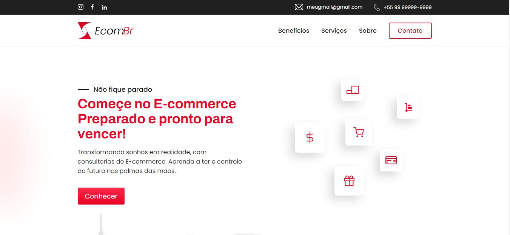

# EcomBR

<!---Esses são exemplos. Veja https://shields.io para outras pessoas ou para personalizar este conjunto de escudos. Você pode querer incluir dependências, status do projeto e informações de licença aqui--->

> A ideia do EcomBR é prestar consultoria com excelência e qualidade para pessoas que desejam iniciar ou já fazem parte do mundo E-commerce.

### Ajustes e melhorias

O projeto ainda está em desenvolvimento e as próximas atualizações serão voltadas nas seguintes tarefas:

- [x] Briefing
- [x] Prototipagem	
- [x] Conteúdo do website
- [x] Estilização do conteúdo
- [x] Menu-Hamburger
- [x] Deixar a página dinâmica

## 🤝 Colaboradores

Pessoas responsáveis pelo projeto:

<table>
  <tr>
    <td align="center">
      <a href="https://github.com/damasioCode/">
         
        
          <b>Daniel Damasio</b>
        
      </a>
    </td>
    <td align="center">
      <a href="https://github.com/MarcosDS7">
         
        
          <b>Marcos Souza</b>
        
      </a>
    </td>
  </tr>
</table>

## 📝 Licença

Esse projeto está sob licença. Veja o arquivo [LICENÇA](LICENSE.md) para mais detalhes.

[⬆ Voltar ao topo](#EcomBR) 
